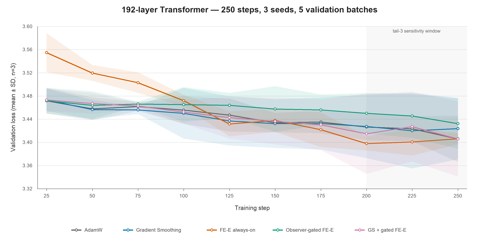

# Apple MLX 192 层三种子、250 步 FE-E 对比实验

## 结论摘要

在第 250 步预注册终点上，AdamW、常开 FE-E 和 GS + 门控 FE-E 的均值几乎相同，分别为 3.4060、3.4062 和 3.4060；Gradient Smoothing 为 3.4236，门控 FE-E 为 3.4324。常开 FE-E 相对 AdamW 的配对差为 +0.0002 [-0.1193, +0.1198]，n=3 的区间很宽，不能宣称终点胜出。

常开 FE-E 的积极信号体现在稳定性和尾段表现：终点跨种子 SD 为 0.0094，AdamW 为 0.0399；最后三个检查点平均为 3.4017，AdamW 为 3.4187。尾段配对差仍跨零，因此应视为下一轮验证假设，而非统计结论。

## 实验协议

- 192 层 Pre-LN Transformer，宽度 32、4 个头、序列长度 12、批量 8。
- 250 个训练更新；种子 31、47、59；每 25 步评估一次，每次使用 5 个验证 batch。
- 五种方法：AdamW、Gradient Smoothing、常开 FE-E、观测器门控 FE-E、GS + 门控 FE-E；固定周期脉冲不再进入主实验。
- FE-E 系数保持不变：刚度 0.1、质量 0.02、熵 2.0、覆盖带 [0.50, 0.98]。
- 环境：MLX 0.31.2，`Apple M4`，24 GiB 统一内存。

实线为三个种子的检查点均值，阴影为 ±1 个样本标准差；灰色区域标出用于次要敏感性
分析的最后三个检查点。

## 结果

| 方法 | 第 250 步损失 ↓ | 尾 3 点平均 ↓ | 跨种子 SD ↓ | 时间/AdamW | 等时损失 ↓（步数） | 介入率 | 刚度 ↓ | 质量能量 | 覆盖度 ↑ |
|---|---:|---:|---:|---:|---:|---:|---:|---:|---:|
| AdamW | 3.4060 ± 0.0399 | 3.4187 ± 0.0277 | 0.0399 | 1.00× | 3.4060 ± 0.0399 (250) | 0.0% | 2.7161 | 5.63e-07 | 0.004 |
| Gradient Smoothing | 3.4236 ± 0.0531 | 3.4237 ± 0.0576 | 0.0531 | 1.08× | 3.4202 ± 0.0653 (225) | 0.0% | 1.6015 | 5.46e-07 | 0.330 |
| FE-E 常开 | 3.4062 ± 0.0094 | 3.4017 ± 0.0068 | 0.0094 | 1.95× | 3.4318 ± 0.0216 (125) | 100.0% | 0.0560 | 6.40e-06 | 0.526 |
| 观测器门控 FE-E | 3.4324 ± 0.0433 | 3.4426 ± 0.0380 | 0.0433 | 1.24× | 3.4511 ± 0.0350 (183) | 13.5% | 1.5821 | 2.95e-07 | 0.334 |
| GS + 门控 FE-E | 3.4060 ± 0.0647 | 3.4160 ± 0.0646 | 0.0647 | 1.35× | 3.4205 ± 0.0667 (175) | 14.5% | 1.7450 | 1.15e-06 | 0.332 |

主终点配对差（候选减参考；95% t 区间；n=3）：

- GS − AdamW：+0.0176 [-0.0278, +0.0631]。
- 常开 FE-E − AdamW：+0.0002 [-0.1193, +0.1198]。
- 常开 FE-E − GS：-0.0174 [-0.1657, +0.1309]。
- 门控 FE-E − AdamW：+0.0264 [-0.0147, +0.0675]。
- GS + 门控 FE-E − AdamW：-0.0000 [-0.1208, +0.1208]。

尾 3 检查点平均是为降低 5-batch 单点噪声而提供的次要敏感性分析，不替代第 250 步主终点。常开 FE-E 相对 AdamW 的尾段配对差为 -0.0170 [-0.0849, +0.0509]。

## 机制与工程判断

1. 常开 FE-E 将末步归一化刚度从 2.7161 降至 0.0560，将覆盖度从 0.004 提高到 0.526，并将质量能量提高约一个数量级；传播形态控制明确生效。
2. 传播机制改善没有在第 250 步均值上形成任务优势，但 FE-E 的跨种子方差显著较小、尾段平均更好，值得用更多种子和更低噪声验证集复核。
3. 常开 FE-E 约耗时 1.95×；按 AdamW 墙钟预算只能完成约 125 步，等时损失 3.4318，当前仍无计算效率优势。
4. 两个门控方案的介入率分别为 13.5% 和 14.5%，但终点方差较大，未稳定复现常开 FE-E 的尾段下降；触发时机仍是主要问题。
5. 把验证 batch 从 10 降到 5 减少了评估开销，却放大了单检查点波动。后续发表级实验建议恢复至少 10 个固定验证 batch，或使用更大的固定验证集。

## 完整性审计

- 15 个运行、3750 个训练步、3780 条 JSONL 记录；全部运行正常结束。
- 失败 0，非有限值 0；完整性检查 `True`。
- 所有门控介入均满足 FE-E 梯度增量不超过任务梯度范数 0.5 的信赖域（浮点容差内）。
- 正式源码 SHA-256：`e175a370ed4739196082548039019d251a843b0f870ae7adc8419f1fc0bcb6f1`。

## 证据位置

- 正式运行：`results/mlx_d192_s3_step250_eval5/run_20260805_110956`
- 逐步日志：`logs/*.jsonl`。
- 每方法/种子摘要：`runs/*.json`。
- 配置、命令、硬件和源码哈希：`manifest.json`。
