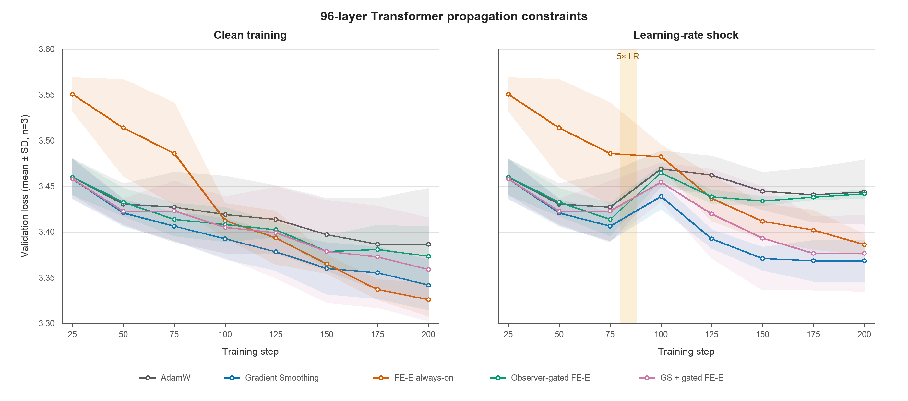

# Apple MLX 96 层 FE-E 正式对比实验

## 结论摘要

冻结 24 层调参结果后，在 96 层、三随机种子、200 步协议中，常开 FE-E 的干净训练评估损失最低：3.3263，AdamW 为 3.3867，Gradient Smoothing 为 3.3423。常开 FE-E 相对 AdamW 的配对差为 -0.0604 [-0.1722, +0.0514]，相对 GS 为 -0.0160 [-0.0778, +0.0458]；n=3 的区间仍较宽，属于积极信号而非统计定论。

工程代价同样明确：常开 FE-E 每步耗时约 1.98× AdamW，而 GS 约 1.09×。按 AdamW 的墙钟训练预算截断后，常开 FE-E 只能完成约 92 步，等时损失为 3.4632，因此当前优势是“等更新次数、算力充足”的优势，不是“等时间”的效率优势。

固定周期脉冲 FE-E 已依据 24 层负结果退出主实验，本轮只比较五种保留方案。96 层结果再次显示：常开 FE-E 比当前门控版本更可靠；观测机制的研究价值在于将高成本二阶介入变成按需控制，但现有触发器尚未达到这一目标。

## 冻结实验协议

- 96 层 Pre-LN Transformer，宽度 32、4 个注意力头、序列长度 12、批量 8。
- 反序列合成任务；200 次参数更新；确认种子 31、47、59。
- 方法：AdamW、论文式 Gradient Smoothing、常开 FE-E、观测器门控 FE-E、GS + 门控 FE-E。
- FE-E 系数沿用 24 层冻结值：刚度 0.1、质量 0.02、熵 2.0、覆盖带 [0.50, 0.98]。
- 门控前 24 步校准，每 8 步精确探测，介入 4 步，FE-E 梯度增量上限为任务梯度范数的 50%。
- 压力协议在第 80–87 步将学习率由 0.002 临时提高到 0.010。
- 环境：MLX 0.31.2，`Apple M4`，24 GiB 统一内存。

图中实线为三个确认种子的平均验证损失，阴影为 ±1 个样本标准差；右图黄色区域为
第 80–87 步的 5× 学习率冲击。

## 干净训练

| 方法 | 评估损失 ↓ | 准确率 ↑ | 时间/AdamW | 峰值内存 | FE-E 介入率 | 刚度 ↓ | 覆盖度 ↑ | 等时损失 ↓（步数） |
|---|---:|---:|---:|---:|---:|---:|---:|---:|
| AdamW | 3.3867 ± 0.0615 | 0.061 ± 0.016 | 1.00× | 39 MiB | 0.0% | 2.4862 | 0.013 | 3.3867 ± 0.0615 (200) |
| Gradient Smoothing | 3.3423 ± 0.0279 | 0.078 ± 0.010 | 1.09× | 39 MiB | 0.0% | 2.5442 | 0.010 | 3.3555 ± 0.0286 (175) |
| FE-E 常开 | 3.3263 ± 0.0183 | 0.086 ± 0.007 | 1.98× | 124 MiB | 100.0% | 0.0778 | 0.532 | 3.4632 ± 0.0687 (92) |
| 观测器门控 FE-E | 3.3736 ± 0.0324 | 0.064 ± 0.017 | 1.32× | 129 MiB | 16.7% | 2.1770 | 0.018 | 3.3871 ± 0.0254 (142) |
| GS + 门控 FE-E | 3.3592 ± 0.0568 | 0.072 ± 0.015 | 1.34× | 129 MiB | 13.3% | 2.3954 | 0.016 | 3.3845 ± 0.0654 (142) |

配对损失差（候选减参考，95% t 区间；n=3）：

- GS − AdamW：-0.0444 [-0.1527, +0.0639]。
- 常开 FE-E − AdamW：-0.0604 [-0.1722, +0.0514]。
- 常开 FE-E − GS：-0.0160 [-0.0778, +0.0458]。
- 门控 FE-E − AdamW：-0.0131 [-0.1149, +0.0887]。
- GS + 门控 FE-E − GS：+0.0169 [-0.0814, +0.1153]。

机制指标与任务结果方向一致：常开 FE-E 将末步归一化刚度从 2.4862 降到 0.0778，相对熵覆盖度从 0.013 提高到 0.532。这说明 FE-E 确实改变了深层伴随场，而非仅靠优化器随机波动。

## 学习率冲击

| 方法 | 评估损失 ↓ | 准确率 ↑ | 时间/AdamW | 峰值内存 | FE-E 介入率 | 刚度 ↓ | 覆盖度 ↑ | 等时损失 ↓（步数） |
|---|---:|---:|---:|---:|---:|---:|---:|---:|
| AdamW | 3.4438 ± 0.0355 | 0.045 ± 0.011 | 1.00× | 39 MiB | 0.0% | 2.3296 | 0.041 | 3.4438 ± 0.0355 (200) |
| Gradient Smoothing | 3.3686 ± 0.0230 | 0.065 ± 0.011 | 1.11× | 39 MiB | 0.0% | 2.2119 | 0.020 | 3.3720 ± 0.0186 (167) |
| FE-E 常开 | 3.3864 ± 0.0115 | 0.066 ± 0.004 | 2.01× | 125 MiB | 100.0% | 0.0776 | 0.499 | 3.4987 ± 0.0390 (92) |
| 观测器门控 FE-E | 3.4419 ± 0.0054 | 0.045 ± 0.005 | 1.40× | 129 MiB | 20.0% | 1.6532 | 0.058 | 3.4386 ± 0.0078 (125) |
| GS + 门控 FE-E | 3.3768 ± 0.0422 | 0.059 ± 0.014 | 1.33× | 99 MiB | 12.0% | 2.5086 | 0.010 | 3.3991 ± 0.0669 (142) |

配对损失差：

- GS − AdamW：-0.0752 [-0.1711, +0.0208]。
- 常开 FE-E − AdamW：-0.0574 [-0.1739, +0.0591]。
- 常开 FE-E − GS：+0.0177 [-0.0539, +0.0894]。
- 门控 FE-E − AdamW：-0.0019 [-0.0795, +0.0757]。
- GS + 门控 FE-E − GS：+0.0082 [-0.0409, +0.0573]。

压力实验检验的是短时学习率跃迁后的恢复，而不是完整鲁棒性。应同时查看最终损失、冲击后的轨迹和跨种子一致性；任何单种子胜负都不足以支持结论。

## 观测器、安全与日志审计

- 两套正式实验共 30 个预期运行、6000 个训练步、6060 条 JSONL 记录；失败 0，非有限值 0。
- 清洁训练中，两个门控方案的单运行报警次数为 [3, 12, 10, 1, 12, 7]；这类报警可视作无外加冲击条件下的介入负担，而不能自动等同于真正误报。
- 压力集精确报警延迟样本为 [16, 2, 8, 0, 8] 步；观测器探测周期为 8 步，因此检测分辨率先天地受限。
- 全部实际介入的最大 `||g_FE,applied|| / ||g_task||` 为 0.500000，未超过 0.5 信赖域。
- 完整性检查：clean=True，stress=True；源码 SHA-256 分别为 `429f85062a3821b3320408d2d86c974f3e4627c61ca66f5def6acd143914bc25` 和 `429f85062a3821b3320408d2d86c974f3e4627c61ca66f5def6acd143914bc25`。

## 从 24 层扩展到 96 层

| 方法 | 24 层损失 | 96 层损失 | 24 层时间比 | 96 层时间比 |
|---|---:|---:|---:|---:|
| AdamW | 3.2162 | 3.3867 | 1.00× | 1.00× |
| Gradient Smoothing | 3.2074 | 3.3423 | 1.07× | 1.09× |
| FE-E 常开 | 3.1644 | 3.3263 | 1.93× | 1.98× |

深度增加后，常开 FE-E 的固定步数优势仍存在，但二阶伴随计算的约 2× 时间代价没有消失。96 层模型在相同宽度与步数下绝对损失更高，不能把 24/96 层损失差直接解释为深度缩放规律；它主要反映当前小任务、残差参数化和短训练预算的组合。

## 工程含义

1. 若目标是固定训练步数、可以接受约 2× 训练耗时，常开 FE-E 在这个受控实验中具有优势；它以算力换取更平滑、更分散的跨层梯度传播和更低终点损失。
2. 若目标是固定墙钟、单位电费或单位 GPU 小时产出，当前 FE-E 没有优势。二阶自动微分是主要成本，显存并非本机小模型的瓶颈。
3. 门控 FE-E 仍值得研究，但理由不是现版本已经胜出，而是它有机会把二阶计算只放在传播异常时。下一版应采用每步一阶代理监测、进入 WATCH 后每 1–2 步精确探测，并用连续动作强度代替满开/满关。
4. 这仍是合成任务上的小规模机制实验。发表级结论需要真实语言建模数据、至少 5 个确认种子、深度/宽度缩放、长训练和强基线（Pre-LN、DeepNorm、µP/残差缩放、梯度裁剪等）。

## 证据位置

- 干净训练：`results/mlx_d96_formal_clean/run_20260805_090049`
- 学习率冲击：`results/mlx_d96_formal_stress/run_20260805_091504`
- 逐步日志：各运行目录下 `logs/*.jsonl`。
- 每方法/种子摘要：各运行目录下 `runs/*.json`。
- 命令、硬件、配置与源码校验：各运行目录下 `manifest.json`。
